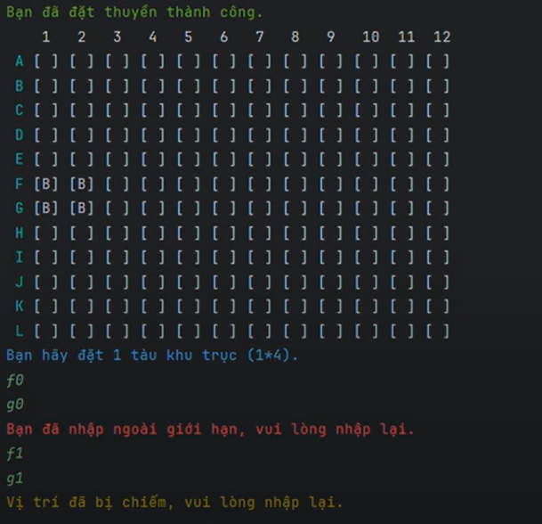

# Sea Battle

Sea Battle là một trò chơi dành cho hai người chơi. Trò chơi được chơi trên bốn lưới, hai cho mỗi người chơi. Các lưới thường là vuông - thường là 10 × 10 - và các ô riêng lẻ trong lưới được xác định bằng chữ cái và số. Trên một lưới, người chơi sắp xếp các tàu và ghi lại các phát bắn của đối thủ. Trên lưới còn lại, người chơi ghi lại các phát bắn của riêng mình.

# Video Demo: [Video Demo](https://youtu.be/kTfVGsDJqJw)

## Cách thức clone
# UML
* Class Diagram:
  
* Activity Diagram:
  
# Demo

 

  

